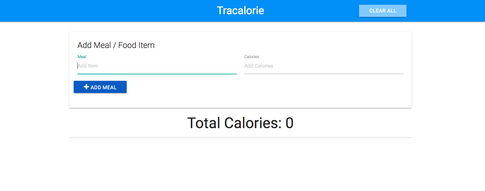
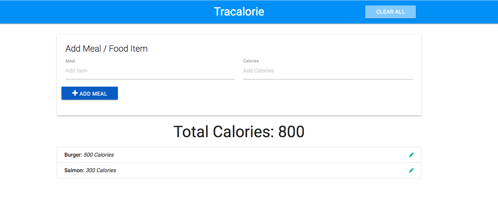
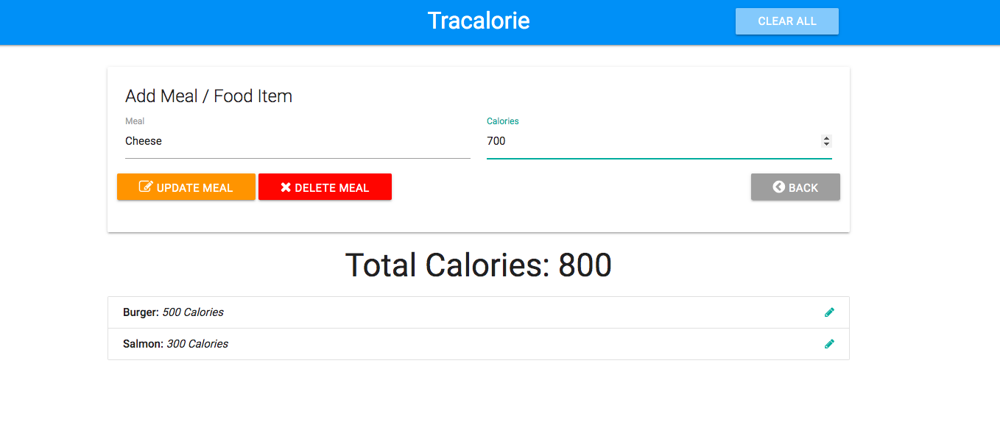
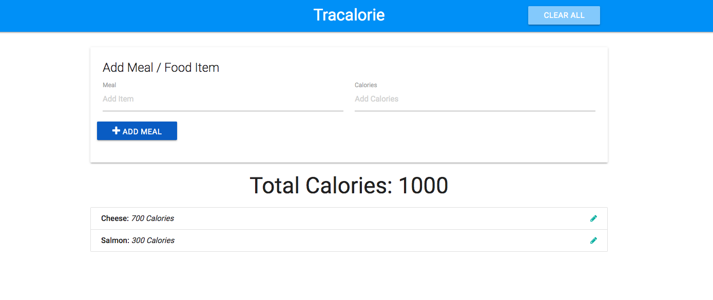
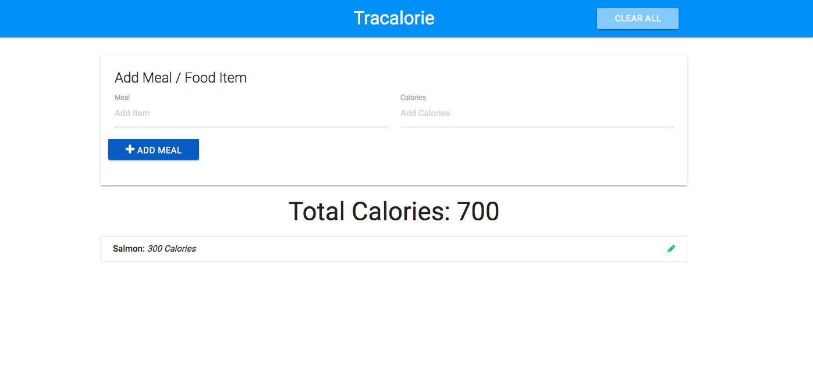
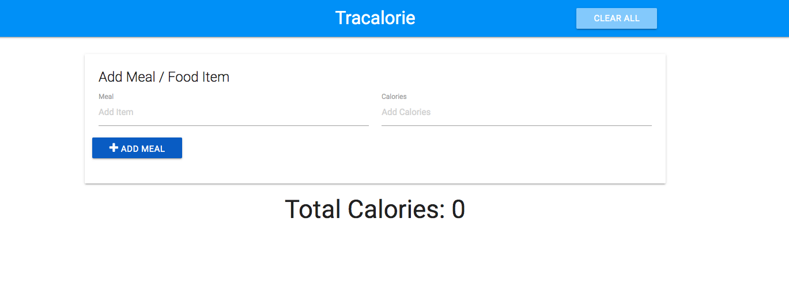

# TraCalorie

## Description:

Tra Calcorie is an application that tracks the amount of calories of the users meals.  The application allows to add meals, update meals, and delete meals. The total calories of each meal is calculated and saved into local storage. A Javascript module pattern was used to organize the code.

 ## Click [here](
https://brianlevin.github.io/TraCalorie/) for the live app. 
 
 This is the home screen:
 
 
  
  
 This is what the app looks like after  the user adds a meal:
 
  
  
  
  This is the UI and functionality when the user wants to update their meal:
    
    
   
   This is the page when the user wants to delete their meal:
      
     
   
   The user can also hit the clear button which will clear all the remaining meals:
    
   
  ## Libraries and Frameworks:

- HTML
- CSS
- Javascript

## Email:

bml201095@gmail.com

